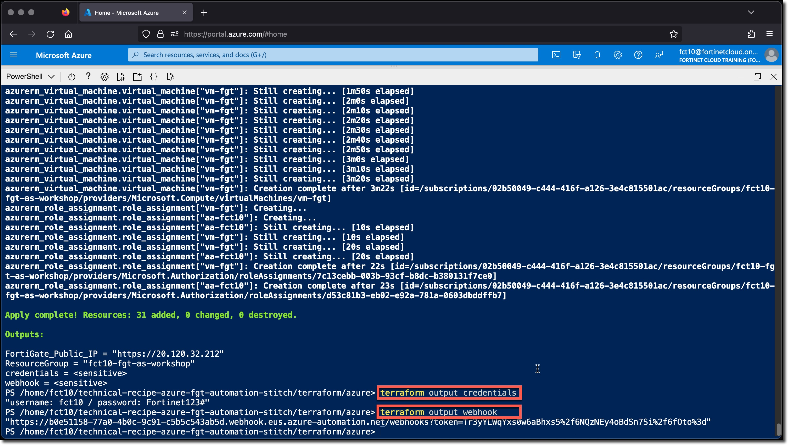

### Task 3 - Terraform Verification

  1. Using the Terraform output, verify that you have Web access to the FortiGate.

      

      * Terraform output can be redisplayed at any point as long as you are in the `./technical-recipe-azure-fgt-automation-stitch/terraform/azure` directory, by using the command `terraform output`
      * To view the FortiGate and Linux VM login credentials use the command `terraform output credentials`

        ```sh
        cd
        cd ./technical-recipe-azure-fgt-automation-stitch/terraform/azure
        terraform output
        terraform output credentials
        ````
