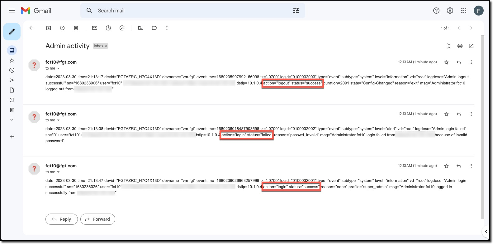

In this task check that the Automation Stitch is working

### Task 4 - Test the Automation Stitch

1. **Logout**
1. **Login** with an incorrect password
1. **Login** with an the correct password
1. **Check** the destination email for Automation Stitch messages.

  
